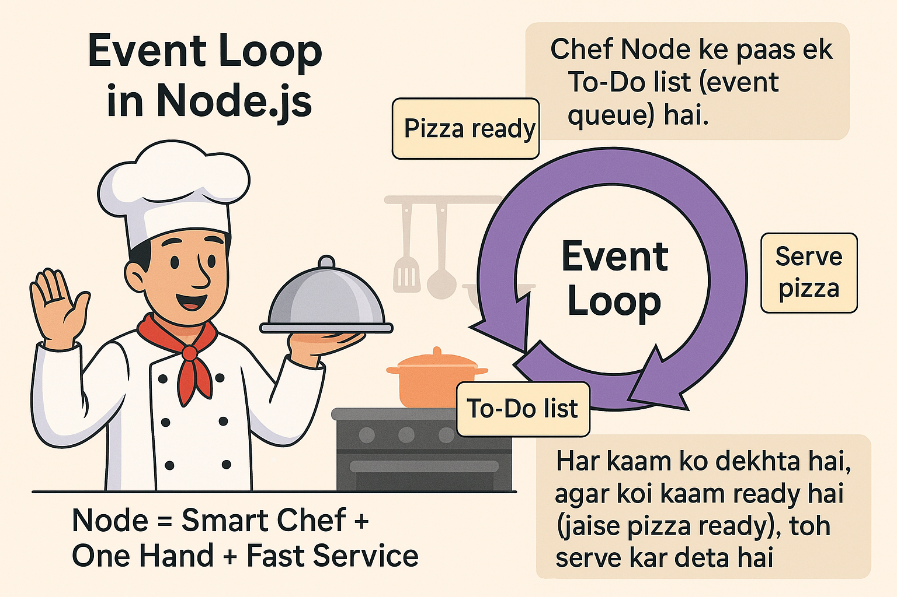

Lets break Event Loop

---

### 🌀 **What is the Event Loop in Node.js?**

**Event Loop** ek mechanism hai jo Node.js ko **multiple kaam ek hi time pe handle karne** mein help karta hai — bina thread badhaye.

🗣️ **Simple words mein:**
> Event loop ka kaam hai: "Kaun kaam ready hai? Usse turant handle karo!"  
> It checks for pending tasks/events and processes them one by one — fast and efficiently.

---

### 🧠 **Easy Trick to Remember:**

> 🧑‍🍳 Chef Node ke paas ek **To-Do list** (event queue) hai.  
> Har kaam ko dekhta hai, agar koi kaam ready hai (jaise pizza ready), toh serve kar deta hai.

Socha:
**"Node = Smart Chef + One Hand + Fast Service"** 🍽️

---

### 🤔 Why is Node.js **Single-threaded**?

Node.js ek hi thread mein chalta hai (matlab ek hi main worker hota hai). Lekin voh **asynchronous** aur **non-blocking** hota hai — iska matlab hai voh wait nahi karta.

🗣️ **Simple Words mein:**

> Ek hi banda sabka kaam sambhal raha hai, lekin smart way mein.  
> Jab tak ek kaam complete ho raha hota hai (e.g. file read), tab tak voh dusra kaam start kar deta hai.

---

### 🪄 Example:

```js
console.log("Start");

setTimeout(() => {
  console.log("After 2 seconds");
}, 2000);

console.log("End");
```

🧠 Output:
```
Start
End
After 2 seconds
```

👉 Ye `setTimeout()` background mein chala gaya (event loop ne handle kiya), baaki code turant execute ho gaya. Jab 2 sec ke baad timer complete hua, tab Node ne "After 2 seconds" print kiya.

---

### 🧾 Summary:

| Feature               | Node.js                                    |
|------------------------|---------------------------------------------|
| 🔁 Event Loop          | Manages background tasks smartly            |
| 🧵 Single Thread       | Only one main thread, but non-blocking      |
| 🧠 Smart Work Style     | Ek banda, kai kaam – without waiting!        |

---

Agar tu yaad rakhe:
> **“Node = Ek smart aadmi, jo har kaam time pe karta hai, bina rukke!”**  
> Event loop us aadmi ka **schedule manager** hai. 📅

