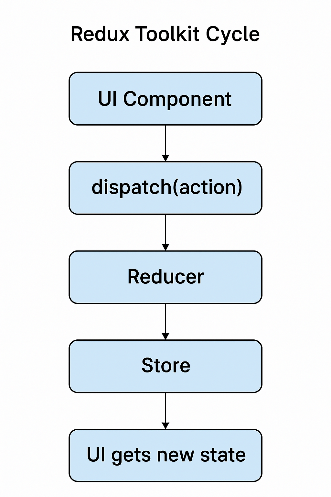

Let’s break down the **Redux Toolkit data flow cycle** (a.k.a. lifecycle) in super simple words — with **real-life analogy**, **visual steps**, and **a clear example**. 🚀

---

## 🔄 **Redux Toolkit Cycle – Step by Step**

> Redux Toolkit ka cycle ek **well-organized delivery system** jaisa hai.  
> Order (action) → Kitchen (reducer) → Update (store) → Serve (UI)

---

## 🎯 Easy Trick to Remember – **"Zomato Food Order Flow" 🍔📱**

| Real Life | Redux Toolkit |
|-----------|----------------|
| You place an order | You dispatch an action |
| Kitchen prepares food | Reducer updates state |
| Rider delivers it | Store provides new state to UI |
| You enjoy food | UI gets updated |

---

### 🔁 Redux Toolkit Cycle Diagram

```plaintext
  [ UI Component ]
         |
      dispatch()
         ↓
 [ createAsyncThunk / createSlice ]
         ↓
 [ Middleware handles async (if any) ]
         ↓
   [ Reducer updates state ]
         ↓
 [ Store holds updated state ]
         ↓
 [ UI gets new state via useSelector ]
```

---

## 🔄 Full Step-by-Step Breakdown

---

### ✅ 1. **Component Dispatches Action**

```js
dispatch(increment());
dispatch(fetchUsers()); // For async
```

🧠 You ask Redux: "Please increase the count!"  
or "Fetch data from server!"

---

### ✅ 2. **Action Reaches Reducer (`createSlice`)**

Reducer is like your kitchen 👨‍🍳 – it prepares the new state

```js
reducers: {
  increment: (state) => {
    state.value += 1;
  }
}
```

Or, for async:

```js
extraReducers: {
  [fetchUsers.pending]: (state) => { state.loading = true }
  [fetchUsers.fulfilled]: (state, action) => { state.users = action.payload }
  [fetchUsers.rejected]: (state, action) => { state.error = action.error.message }
}
```

---

### ✅ 3. **Reducer Updates State in Store**

Now Redux Toolkit updates the store with the new state (like a central memory 🧠)

---

### ✅ 4. **UI Automatically Updates (via `useSelector`)**

```js
const count = useSelector((state) => state.counter.value);
```

Component automatically re-renders with updated data 🖼

---

## 🔁 Example: Simple Counter Flow

```jsx
// Dispatch from UI
<button onClick={() => dispatch(increment())}>+1</button>

// In slice:
reducers: {
  increment: (state) => {
    state.value += 1;
  }
}

// UI updates via useSelector
const count = useSelector((state) => state.counter.value);
```

---

## 🎨 Visual Summary Table

| Step | What Happens | Code |
|------|--------------|------|
| 🧾 Action | User dispatches an action | `dispatch(fetchUsers())` |
| 🛠 Reducer | Slice handles it | `createSlice()` / `extraReducers` |
| 🧠 Store | Updates global state | `configureStore()` |
| 🖼 UI | Renders new state | `useSelector()` |

---

## 🔁 Async Redux Toolkit Cycle (Bonus)

For API calls using `createAsyncThunk`:

| Phase | Action Type | What Happens |
|-------|-------------|--------------|
| 🕒 Start | `fetchUsers.pending` | Show loading spinner |
| ✅ Success | `fetchUsers.fulfilled` | Save data in state |
| ❌ Fail | `fetchUsers.rejected` | Show error message |

---

## 🎉 Final Tip

> Redux Toolkit ka cycle = "Perfect delivery system" 📦  
> Aapne dispatch kiya → state updated → UI refreshed automatically 😎  
> Sab kuch managed in a clean, efficient way 🔥

---

Here's a **visual flowchart** that explains the **Redux Toolkit cycle** in a simple and clean way:

📊 **Redux Toolkit Data Flow Chart**



---

### 🔁 Flow Steps:

1. **UI Component**  
   👉 User interaction triggers an action

2. **Dispatch Action**  
   👉 `dispatch()` sends the action (sync or async)

3. **Reducer Handles It**  
   👉 `createSlice()` or `extraReducers` updates state

4. **Store Updates**  
   👉 Redux Toolkit’s `configureStore()` holds the new state

5. **UI Gets New State**  
   👉 React components use `useSelector()` to read updated data

---