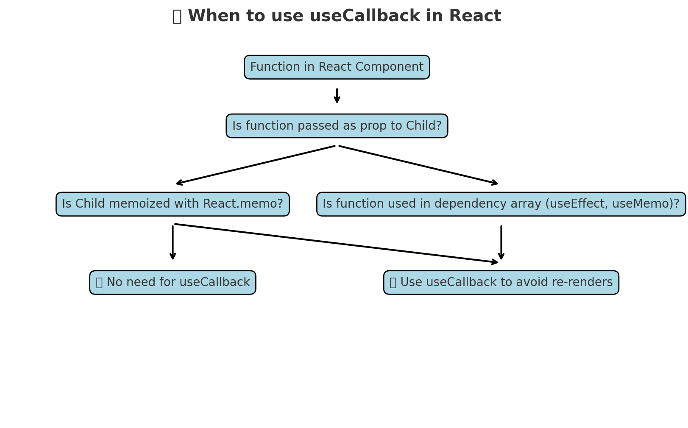

Bahut accha question 👌 — chalo `useCallback` ko thoda **deep level + easy example** ke sath samjhate hain.

---

# 🔹 `useCallback` – Deep Explanation

### Problem Without `useCallback`

React me **functions har render me nayi ban jaati hain** (kyunki JS me functions bhi ek object hote hain).
Agar aap ek child component ko **function prop** pass karte ho, to wo child **dobara render** hoga, chahe function ke andar kuch change na hua ho.

Example 👇

```jsx
function Parent() {
  const [count, setCount] = useState(0);

  const handleClick = () => {
    console.log("Button clicked");
  };

  return (
    <div>
      <button onClick={() => setCount(count + 1)}>Increment {count}</button>
      <Child onClick={handleClick} />
    </div>
  );
}

const Child = React.memo(({ onClick }) => {
  console.log("Child rendered");
  return <button onClick={onClick}>Child Button</button>;
});
```

👉 Jab bhi **Parent re-render** hoga (count badhane par), `handleClick` function ka **naya reference** banega.
👉 Even though humne `React.memo` lagaya hai, **Child re-render hoga** unnecessarily.

---

### Solution: With `useCallback`

```jsx
function Parent() {
  const [count, setCount] = useState(0);

  const handleClick = useCallback(() => {
    console.log("Button clicked");
  }, []); // empty dependency → function reference same rahega

  return (
    <div>
      <button onClick={() => setCount(count + 1)}>Increment {count}</button>
      <Child onClick={handleClick} />
    </div>
  );
}
```

👉 Ab `handleClick` ka **reference fix rahega** until dependencies change.
👉 Matlab `Child` **re-render nahi karega** jab tak uske actual props change nahi hote.

---

# ✅ Benefits of `useCallback`

- Bachata hai **unnecessary child re-rendering**
- Useful jab **functions props ke through pass karte ho**
- Helps jab function **dependency array** me hota hai (like in `useEffect`)

---

# 🎯 Best Use Case

- **Memoized child components** (`React.memo`) ko functions pass karna
- Expensive re-renders ko avoid karna
- Jab function kisi aur `useEffect` ke dependency array me ho

---

# ⚠️ Important Caveats

- Har jagah mat use karo → chhoti apps me zarurat nahi hoti.
- Thoda memory overhead create hota hai (closure store hota hai).
- Sirf tabhi use karo jab **child optimization ya dependency stability** ki need ho.

---

👉 **Shortcut to Remember:**
📌 Agar function **props ke through child** me ja raha hai → use `useCallback`.
📌 Agar function sirf parent me use ho raha hai → normal function hi theek hai.

---



Ye diagram 👆 tumhe ek **decision tree** deta hai ki kab `useCallback` lagana chahiye:

1. Agar tumhara function **child component ko prop ke through pass ho raha hai** → Check karo:

   - Agar child **`React.memo` se memoized hai** → function har render pe change na ho, isliye `useCallback` lagao.
   - Agar child memoized nahi hai → `useCallback` ki zarurat nahi.

2. Agar function **dependency array me use ho raha hai** (jaise `useEffect` ya `useMemo` me) → Har render pe unnecessary trigger avoid karne ke liye `useCallback` lagao.

3. Agar function sirf component ke andar hi use ho raha hai aur kahi pass/dep nahi hai → ❌ `useCallback` ki zarurat nahi.

---

👉 Simple line me:
`useCallback` sirf tab lagao jab **function reference stable rakhna zaruri ho** to avoid re-renders or unnecessary effect triggers.

Kya mai iska ek **cheat sheet (markdown)** bana du taaki tum interview se pehle ek glance me revise kar sako?
